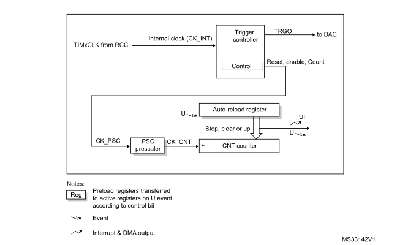

# Timer

### Types of Timers
- [Basic](#Basic-Timers)
- General Purpose
- Advanced
- High Resolution
- Low Power

## Basic Timers
- time-based generation
- drive ADC/DAC (internally connected to those peripherals)

### Time Frequency
Register | Purpose | Range
--- | --- | ---
Counter (CNT) | The current counter value | `0 - 0xFFFF / 0xFFFF FFFF`
Auto-Reload Register (ARR) | The value for the timer to count up to | `0xFFFF / 0xFFFF FFFF `
Prescaler (PSC) | Clock frequency divider | `1 - 0xFFFF (0 would disable counter)` 

Timer frequency `(Update Event)` determiend by Period `(ARR)` and Prescaler `(PSC)`:
```
                        Timer Clock (Hz)
Timer Frequency (Hz) = -------------------
                       (PSC + 1) (ARR + 1)

```


#### HAL Example
``` C++
/* Setups TIM6 to interrupt every 25us on a 40Mhz Timer Clock */

/* Initialize Timer */
__HAL_RCC_TIM6_CLK_ENABLE();

TIM_HandleTypeDef htim6;
htim6.Instance       = TIM6;
htim6.Init.Period    = 24;
htim6.Init.Prescaler = 39;

if (HAL_TIM_Base_Init(&htim6) != HAL_OK)
{
    while(1);
}
```

### Polling Mode
``` C++
// use timer value
if (Counter >= Value) 
{ ... }

// or use update event flag`
if (Update Interrupt Flag Set) 
{
    Clear Update Event Flag // Clear flag otherwise lose all other events
    ...
}
```
### Interrupts
- Interrupts on `Update Interrupt Flag (TIMx_SR_UIF)`

### DMA
- Basic timers only implement `DMA Update Requests (TIMx_UP)` 

## General Purpose Timers